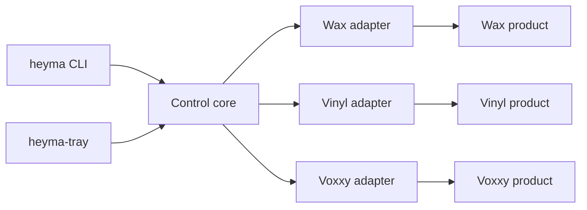
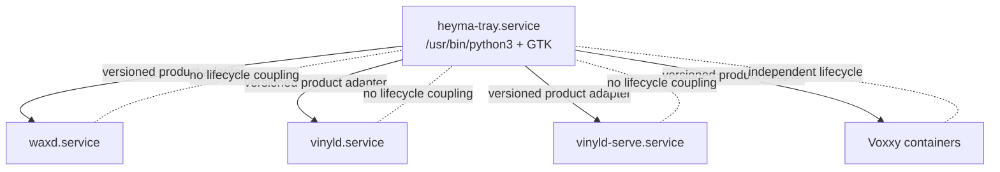

# Architecture Spine — HeyMa Federated Audio Control Plane

## Decision at a Glance

HeyMa is the integration product, not a source monorepo. Vinyl and Voxxy remain
autonomous products that HeyMa discovers and controls through versioned public
contracts. Wax remains embedded in HeyMa for the first migration. One standalone
`heyma-tray` owns the aggregate desktop experience; no product depends on it.

The names `stt` and `tts` are logical capability domains, not directories into
which product source is copied, vendored, or mounted as Git submodules.

## Design Paradigm

HeyMa is a **hexagonal control plane over autonomous products**. The control
core owns normalized observation, safe-action policy, and aggregation. The CLI
and GTK tray are inbound adapters. Wax, Vinyl, and Voxxy integrations are
outbound adapters. Product engines remain outside the hexagon.



## Invariants & Rules

### AD-1 — Federated product architecture [ADOPTED]

- **Binds:** HeyMa, Vinyl, and Voxxy source and release ownership.
- **Prevents:** Products becoming source-coupled merely to share one desktop UX.
- **Rule:** Vinyl and Voxxy remain independently versioned, installable,
  releasable, and operable repositories. HeyMa never vendors or imports their
  implementation packages.

### AD-2 — HeyMa owns the integration control plane [ADOPTED]

- **Binds:** Unified tray, aggregate status, cross-product workflows,
  integration configuration, and stack tests.
- **Prevents:** Multiple products competing to own the aggregate user experience.
- **Rule:** HeyMa owns the normalized aggregate model and unified UX. Each
  product remains the sole owner of its engine state and lifecycle.

### AD-3 — Adapter-mediated product integration [ADOPTED]

- **Binds:** All HeyMa-to-product communication.
- **Prevents:** Runtime dependency coupling and private-state scraping.
- **Rule:** Adapters read one documented, authoritative product status surface
  and invoke only product-owned stable CLIs or public APIs. They never import
  product code, read product databases, call deployment tools such as
  `systemctl` or Docker directly, or use Git submodules as integration.

### AD-4 — Bounded tray authority [ADOPTED]

- **Binds:** User-facing actions.
- **Prevents:** An always-running convenience UI becoming a destructive fleet
  administrator.
- **Rule:** The tray may expose desired-state recording and dictation controls,
  queue and health inspection, engine selection, product-owned safe restart,
  bounded diagnostics, logs, and open-output actions. It never exposes reset,
  delete, purge, credential mutation, or destructive data operations.

### AD-5 — Standalone aggregate tray [ADOPTED]

- **Binds:** Desktop process and service topology.
- **Prevents:** A UI failure taking down audio work and an unnecessary aggregate
  daemon becoming another source of truth.
- **Rule:** `heyma-tray` is one independently restartable process executed by
  `/usr/bin/python3`. No product requires it for capture, dictation,
  transcription, enrichment, or synthesis.

### AD-6 — Inward dependency direction

- **Binds:** Control-plane modules.
- **Prevents:** GTK, CLI, and product transports choosing incompatible domain
  models.
- **Rule:** The control core defines ports and value types. UI, CLI, and product
  adapters depend on the core; the core imports none of them.

### AD-7 — Normative dual versioned contracts

- **Binds:** Cross-repository status compatibility.
- **Prevents:** Same-name schemas with incompatible envelopes, enums, or
  semantics silently breaking the aggregate tray.
- **Rule:** Every provider response contains a root `schema` discriminator and
  validates against its product-owned JSON Schema 2020-12 contract:
  `wax.status.v1`, `vinyl.status.v1`, or `voxxy.health.v1`. HeyMa normalizes
  supported provider contracts into the adjacent normative v1 schemas and
  `CONTROL-CONTRACT.md`. Version 1 enum sets and meanings are frozen; only
  optional object fields may be added. New required fields, enum members, or
  changed semantics require v2.

### AD-8 — Deterministic, trusted discovery

- **Binds:** Product instance selection and adapter loading.
- **Prevents:** Two clients controlling different instances, insecure executable
  substitution, arbitrary plugin execution, and hard-coded checkout paths.
- **Rule:** An explicit `$XDG_CONFIG_HOME/heyma/control.toml` product stanza is
  authoritative and suppresses fallback. Otherwise, the adapter uses its
  documented built-in candidate order. Executables resolve once to absolute
  regular files owned by the current user or root and not group/world writable;
  actions revalidate that identity. Version 1 has no dynamic plugin loader.

### AD-9 — Products operate headlessly

- **Binds:** Product status/action surfaces and tray cutover.
- **Prevents:** Duplicate indicators and the unified tray becoming a runtime
  prerequisite.
- **Rule:** Every product exposes UI-free status and actions. Wax gains a
  no-tray mode, Vinyl keeps its tray separable, and Voxxy remains headless.
  Native trays are disabled only after unified-tray parity is verified.

### AD-10 — Deterministic, fault-isolated observation

- **Binds:** Polling, freshness, progress, and aggregate icon policy.
- **Prevents:** One missing, slow, stale, or malformed product freezing the tray
  or letting the CLI and tray report incompatible states.
- **Rule:** Adapters poll concurrently off the GTK thread under the core-owned
  timing policy below. Each adapter has at most one observation in flight;
  overlapping rounds coalesce and late generations are discarded. The core
  alone derives freshness and the total RED-over-YELLOW-over-GREEN result.
  Provider progress is shown only when its numerator, denominator, unit, and
  scope are explicit; elapsed time never becomes synthetic progress.

### AD-11 — Disposable projection with a narrow safety latch

- **Binds:** Aggregate state mutation and persistence.
- **Prevents:** HeyMa becoming a second lifecycle authority while forgetting a
  known active microphone after a tray restart.
- **Rule:** Product state remains authoritative and version 1 has no aggregate
  database or daemon. HeyMa may persist only microphone safety latches in
  `$XDG_STATE_HOME/heyma/safety-latches.json`, guarded by `flock`, fsync, and
  atomic replace across CLI and tray processes. A latch clears only after a
  fresh authoritative inactive observation for the same installation, or an
  explicit CLI acknowledgement that the old instance was retired. The tray
  never exposes latch clearing.

### AD-12 — Product-atomic desired-state actions

- **Binds:** Action dispatch across the tray, CLI, and native clients.
- **Prevents:** Toggle retries, stale authorization, duplicate side effects,
  shell injection, and service mutation during protected work.
- **Rule:** UI toggles resolve to explicit `start` or `stop`; adapters never
  retry a timed-out mutation automatically. Every invocation carries a request
  ID and expected provider revision. The adapter re-observes fresh state, then
  the product rechecks action-specific inhibitors under its own cross-client
  serialization and idempotency boundary. Stale, unknown, malformed, or
  unreachable state fails closed for disruptive actions.

### AD-13 — Products own credentials

- **Binds:** Local configuration and remote authentication.
- **Prevents:** HeyMa becoming another credential store.
- **Rule:** HeyMa stores discovery and non-secret endpoint data only. Product
  CLIs or credential helpers own authentication and secret retrieval. Adapters
  allowlist returned fields, bound response sizes, strip control characters,
  escape UI text, and redact errors before display or journald.

### AD-14 — Enforceable consumer-driven compatibility

- **Binds:** Independent product releases and control-plane changes.
- **Prevents:** Provider and consumer CI passing against divergent contract
  copies.
- **Rule:** Each product publishes an immutable, tagged schema-and-fixture
  bundle and validates real provider output plus backward compatibility in CI.
  HeyMa pins each bundle digest, tests every supported producer release, and
  maintains the compatibility matrix. Rollout order is provider-additive first,
  HeyMa support second, and old-major retirement last.

### AD-15 — Explicit operational envelope

- **Binds:** Installation, startup, failure, diagnostics, and updates.
- **Prevents:** PATH Python drift, malformed optional configuration taking down
  the tray, and hidden product lifecycle coupling.
- **Rule:** HeyMa installs and updates `heyma-tray` from this repository as a
  graphical-session user service with `Restart=on-failure`, bounded restart
  rate, and journald diagnostics. Its entry points execute `/usr/bin/python3`
  explicitly. Invalid adapter configuration fails only that adapter. The unit
  has no product `Requires=`, `PartOf=`, shared environment, or shared lock.

### AD-16 — Logical capability domains, physical product ownership

- **Binds:** Repository reorganization and audio-path preservation.
- **Prevents:** `./stt` and `./tts` becoming source copies or accidental
  monorepo roots, and repository work silently changing live audio ownership.
- **Rule:** `stt.capture`, `stt.dictation`, and `tts.synthesis` are contract
  metadata and navigation concepts. HeyMa stores its control plane and embedded
  Wax source; Vinyl and Voxxy stay in their repositories. Repository and tray
  migration never relocates recordings, transcripts, product state, models,
  credentials, or voice assets.

### AD-17 — Wax ingress ownership target

- **Binds:** The conflicting project instructions, Syncthing configuration,
  and deployed Wax path model.
- **Prevents:** Local writers placing irreplaceable audio in a Syncthing
  `receiveonly` directory.
- **Rule:** The target maps Syncthing `receiveonly` to `~/HeyMa/dropoff`, which
  Wax only reads and copies. Wax owns local `~/HeyMa/stream` and
  `~/HeyMa/inbox`. Until an idle, byte-conserving migration proves that target,
  the current `AGENTS.md` prohibition remains binding.

### AD-18 — Continuous, idempotent Wax dropoff import

- **Binds:** Cross-device ingress after Syncthing moves to `dropoff`.
- **Prevents:** Recordings stalling outside Wax, duplicate imports, and mutation
  of a receive-only source.
- **Rule:** Wax reconciles `dropoff` at boot and during runtime. It ignores
  Syncthing temporaries, copies a stable source through inbox-local fsynced
  staging, verifies full SHA-256 identity before atomic no-replace publication,
  records the import idempotently, and never writes to or deletes from `dropoff`.

### AD-19 — Durable product maintenance leases

- **Binds:** Safe migration and lifecycle mutation while product daemons may be
  stopped.
- **Prevents:** A CLI, hotkey, tray, or remote client starting protected work
  during reconfiguration or cutover.
- **Rule:** Each product persists a 30–300 second lease with token, owner,
  reason, instance, epoch, revision, and expiry under the product-wide action
  lock. Every protected entry point checks it, including daemon-independent
  CLIs. Acquire, renew, and release are idempotent and visible in status; expiry
  releases the lease. The exact protocol is in `contracts/CONTROL-CONTRACT.md`.

## Normative Control Contract

The adjacent `contracts/*.schema.json` files are the exact v1 wire structures;
`contracts/CONTROL-CONTRACT.md` supplies cross-field and transition invariants
that JSON Schema cannot express. This section is a readable summary. The schema
governs shape, the contract companion governs transitions, and AD-1 through
AD-19 govern ownership and dependency boundaries.

### Provider header

Every provider status document has these required root fields:

| Field | Rule |
| --- | --- |
| `schema` | Exact product schema name ending in `.vN`. |
| `instance_id` | Stable opaque identity for the installed product instance. |
| `epoch` | Opaque runtime epoch; changes whenever provider generation restarts. |
| `generation` | Increments for semantic status/action/lease changes, never a heartbeat-only write. |
| `updated_at` | RFC 3339 UTC heartbeat timestamp, refreshed at least every 5 seconds. |
| `maintenance` | Token-free inactive/active lease projection. |

CLI status writes exactly one JSON object to stdout. HTTP status uses
`application/json`. A missing/invalid discriminator or a document invalid under
a supported schema is `malformed`; a well-formed unknown schema name or major is
`unsupported`. Neither is best-effort healthy. Tagged v1 schemas may add
optional fields, but tagged artifacts are immutable.

Vinyl's provider document is one product-owned aggregate over named `local`,
`client`, and `serve` roles. Its product-level microphone state is the logical
OR of those roles. Voxxy distinguishes service availability from per-engine
health. Wax reports capture and queue work independently.

### Aggregate envelope

`heyma status --json` emits one object with these required fields:

```json
{
  "schema": "heyma.control.v1",
  "observed_at": "2026-08-12T20:30:00Z",
  "indicator": "yellow",
  "components": [],
  "operations": []
}
```

Components are sorted by `component_id`; one row is retained for every built-in
or configured component, including an optional absent product. Each row has:

```text
component_id, display_name, domains[], required, indicator
provider_revision { instance_id, epoch, generation } | null
observed_at, source_updated_at | null
presence       present | absent | misconfigured
reachability   reachable | unreachable | unknown
freshness      fresh | stale | unknown
health         ok | degraded | error | unknown
microphone     active | inactive | unknown
workloads[]    { id, kind, phase, stage, progress | null, label }
attention[]    { severity, code, message, actionable }
capabilities[], actions[]
queue | null, engines | null, details {}
```

The v1 workload kinds are `capture`, `dictation`, `archive`, `transcription`,
`enrichment`, `synthesis`, and `service-operation`. Phases are `queued`,
`running`, `finalizing`, `completed`, `failed`, and `canceled`. A terminal
workload remains for at least five seconds and one subsequent heartbeat; its
removal increments provider generation. Progress is either null or
`{current, total, unit, scope}` with `total > 0` and
`0 <= current <= total`; `100%` never means completion by itself.

`queue` normalizes pending and failed counts plus the current item and stage.
`engines` normalizes the selected engine and each engine's availability and
health. Product-only fields remain in the component-namespaced `details`
object and never drive core safety policy.

Attention severity is one of `info`, `warning`, or `error`. The v1 capability
registry is `capture.control`, `dictation.control`, `queue.inspect`,
`health.inspect`, `engine.select`, `service.restart`, `logs.open`, and
`output.open`. Action IDs are product-namespaced stable tokens, while the
capability tells generic CLI and tray code how to render them.

An absent component has null provider revision, `presence=absent`, unknown
reachability/freshness/health/microphone, empty work and attention arrays, and
no actions. Invalid cross-field combinations are malformed. With a prior valid
row, retain its provider data as stale and add attention. At cold start,
malformed/unsupported responses synthesize
`present/reachable/unknown/unknown/unknown`; transport failure synthesizes
`present/unreachable/unknown/unknown/unknown`. The normative failure table is in
`contracts/CONTROL-CONTRACT.md`.

### Freshness and aggregate color

Cold-start defaults are one poll every 2 seconds, a 1-second local-command or
Unix-socket deadline, a 2-second HTTP deadline, and a 10-second stale threshold.
Configuration may slow polling to 30 seconds, but stale time must be at least
three poll intervals and twice the provider heartbeat. A disruptive action must
complete a fresh re-observation within 2 seconds before dispatch.

Freshness uses provider heartbeat age, not the time at which HeyMa rereads a
cached file. The core advances age with a monotonic clock after receipt. A
provider timestamp more than 30 seconds in the future yields `clock_skew`
attention and cannot authorize a disruptive action.

The core assigns a monotonic poll sequence. Only the newest completed sequence
may replace a row. Suspend/resume invalidates all fresh classifications and
triggers an immediate poll. Timeouts terminate the owned subprocess group or
request; stdout, stderr, and HTTP bodies are bounded to 1 MiB.

The aggregate color is a total ordered function:

| Priority | Color | Condition |
| --- | --- | --- |
| 1 | RED | Any fresh microphone is active, or any durable microphone latch remains uncleared. |
| 2 | YELLOW | Otherwise, any row is outside the neutral set, or an operation is `accepted`, `rejected`, `failed`, or `timed_out_unknown`. |
| 3 | GREEN | Every row is neutral. |

The neutral set is either an optional absent product, or a present, reachable,
fresh, healthy product with an inactive microphone and no actionable warning or
error. Required absence, misconfiguration, unreachable or unknown status,
staleness, degraded/error/unknown health, and malformed or unsupported contracts
are therefore always YELLOW unless RED takes precedence.

### Actions and results

The outbound port algebra is:

- `probe() -> DiscoveryResult`: read-only target selection;
- `observe(target, poll_seq) -> ObservationResult`: read-only status;
- `actions(snapshot) -> ActionDescriptor[]`: pure policy projection; and
- `invoke(ActionRequest) -> ActionResult`: the only side-effecting call.

An action descriptor has a namespaced stable ID, capability, closed argument
schema, `enabled` UX hint, and machine/human disabled reason. The hint is not
authorization. Arguments are enum-, length-, and trusted-root validated before
being placed into fixed argv slots; configuration supplies command arrays, not
shell strings or interpolation templates.

An action request contains `request_id`, `component_id`, `action_id`, validated
arguments, and the expected `{instance_id, epoch, generation}`. Results use
`accepted`, `completed`, `rejected`, `failed`, or `timed_out_unknown`, with a
stable code and redacted detail. `accepted` remains in flight until observation
confirms the requested state. A timeout is reconciled by observation and is
never automatically retried. The aggregate `operations[]` carries unresolved
and unacknowledged results: completed clears after one fresh poll; rejected and
failed clear on local acknowledgement or a later success; timed-out-unknown
clears only after reconciliation proves completed or failed.

Product-owned action endpoints serialize all callers and deduplicate request
IDs. At minimum:

- Wax restart/reconfiguration/cutover is inhibited by recording, finalizing, an
  active queue item, or another Wax operation.
- Vinyl reports aggregate microphone activity and names the exact local or
  serve service targeted by a lifecycle action.
- Voxxy restart or engine selection is inhibited by active synthesis unless the
  product explicitly proves the action non-disruptive.

Log access is a bounded tail or an external terminal/viewer launch that returns
immediately; it never occupies the component action slot as a follow process.

## Discovery and Trust Policy

| Order | Candidate | Result on failure |
| --- | --- | --- |
| 1 | Explicit product stanza | No fallback; invalid is misconfigured, unreachable is YELLOW. |
| 2 | Product-specific built-in command resolved from `PATH` | Pin it; malformed or unreachable means YELLOW with no fallback. If missing, try order 3. |
| 3 | Documented local Unix socket or loopback endpoint | If absent, classify the unconfigured product as optional absent. |

An explicit stanza is required unless it says `required=false`; an unconfigured
built-in product is optional. Command files and `control.toml` must be owned by
the current user or root and not group/world writable. The threat boundary is
the logged-in user; HeyMa does not try to defend against that same user replacing
their own trusted binaries.

Unix sockets and loopback HTTP are allowed by default. A remote endpoint needs
`allow_remote=true`, verified HTTPS, no redirects, and bounded response size.
Remote control uses a product-owned authenticated CLI or credential helper;
secrets never enter presentation code.

## Brownfield Ratification

The project-level safety invariant remains: a Syncthing `receiveonly` directory
must never receive local writes. Live inspection found a pre-existing conflict:
Syncthing still maps `~/HeyMa/inbox` as `receiveonly`, while deployed Wax treats
that path as its local queue. This spine does not ratify the conflict or silently
choose a live data migration.

The target ownership model is Wax's two-boundary design: Syncthing receives into
`dropoff`; Wax only reads/copies from `dropoff`; Wax owns local `stream` and
`inbox`. Reaching that target requires the separate byte-conserving, idle-only
runbook in the migration plan. Until its exit gate passes, the existing
`AGENTS.md` prohibition on local writes to the receive-only path is binding.

The target is not operable until the AD-18 importer exists and passes restart,
stability, collision, deduplication, and never-mutate-source tests. Repository
layout alone cannot substitute for that product ingress behavior.

Source topology and runtime audio topology are independent. The empty `./stt`
and `./tts` directories are not source roots and must not be populated with
copies or submodules. The tray migration cannot move or rename any runtime audio
directory.

## Stack Seed

| Name | Verified host baseline |
| --- | --- |
| CPython | `/usr/bin/python3` 3.13.7 |
| PyGObject | 3.50.0 |
| GTK | 3.24.50 |
| AyatanaAppIndicator3 GIR | 0.1 (`0.5.94-1`) |
| systemd user services | 257.9 |

These are the deployed-host baseline, not application pins. Product runtimes
and dependencies remain product-owned and are outside the HeyMa control-plane
environment.

## Structural Seed

```text
HeyMa/
  apps/tray/
    bin/                         # heyma, heyma-tray; /usr/bin/python3
    src/heyma_control/
      model.py                   # heyma.control.v1 values
      aggregate.py               # freshness, latches, indicator policy
      policy.py                  # action allowlist and preconditions
      cli.py                     # non-GTK inbound adapter
      tray.py                    # GTK inbound adapter
      adapters/{base,wax,vinyl,voxxy}.py
    assets/
    tests/
  contracts/
    control/v1/snapshot.schema.json
    actions/v1/{descriptor,request,result,operation,maintenance}.schema.json
    providers.lock
    compatibility.toml
    providers/{wax,vinyl,voxxy}/
  deploy/systemd/user/heyma-tray.service
  tests/stack/
  components/wax/                # canonical Wax source for the first migration
```



## Capability → Architecture Map

| Capability / Area | Lives in | Governed by |
| --- | --- | --- |
| Aggregate status and icon | `heyma_control/aggregate.py` | AD-2, AD-10, AD-11 |
| Safe aggregate controls | `heyma_control/policy.py` | AD-4, AD-12, AD-13 |
| CLI diagnostics | `heyma_control/cli.py` | AD-5, AD-6, AD-7 |
| Desktop tray | `heyma_control/tray.py` | AD-5, AD-9, AD-10, AD-15 |
| Wax integration | `heyma_control/adapters/wax.py` | AD-3, AD-7, AD-8, AD-12 |
| Vinyl integration | `heyma_control/adapters/vinyl.py` | AD-1, AD-3, AD-7, AD-12 |
| Voxxy integration | `heyma_control/adapters/voxxy.py` | AD-1, AD-3, AD-7, AD-12 |
| Product implementations | Product repositories; Wax under `components/wax/` | AD-1, AD-2, AD-9, AD-16 |
| Wax audio ingress ownership | Product runtime, outside tray source layout | AD-16, AD-17, AD-18 |
| Product maintenance leases | Product-owned CLI/API and durable state | AD-12, AD-19 |
| Cross-product compatibility | Pinned contracts and `tests/stack/` | AD-7, AD-14 |

## Deferred

- **Wax repository extraction:** revisit after the unified tray and Wax adapter
  complete a 30-day production soak. Preserve Git history and all public
  CLI/systemd entry points if extracted.
- **Dynamic third-party adapters:** revisit when a fourth product or external
  contributor needs installation without changing HeyMa.
- **Aggregate daemon or event bus:** revisit only if bounded concurrent polling
  cannot meet the declared timing and resource limits.
- **Shared cross-repository SDK:** revisit only after three independent products
  duplicate the same non-trivial contract implementation. JSON schemas remain
  the interoperability source until then.
- **Cross-platform tray toolkit:** revisit when a second desktop must run the
  aggregate tray.
- **Destructive administration:** remains outside the tray; use product-native
  CLIs with their existing confirmations.
