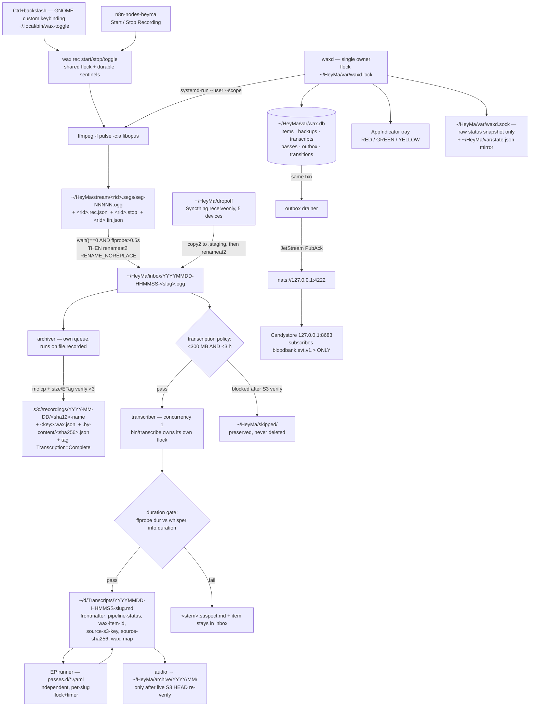
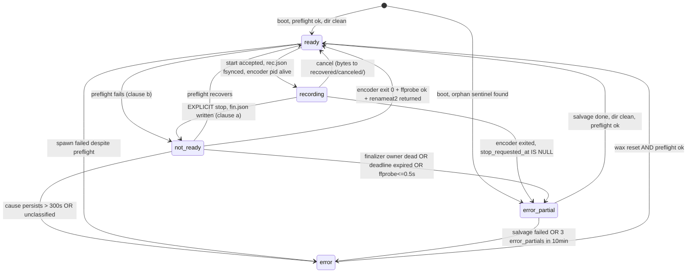
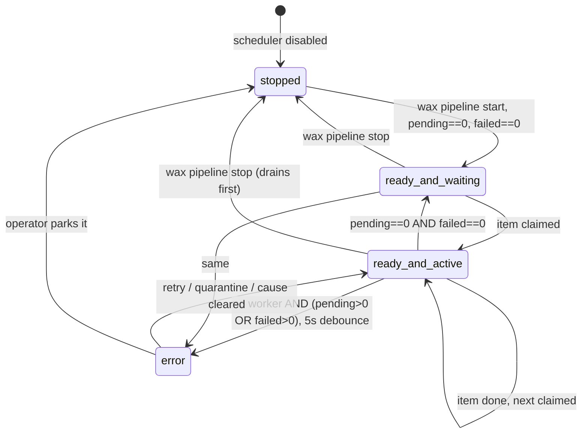

# Wax

**One daemon owns the microphone, the two folders, and the ledger; the filesystem carries enough forensic evidence that a cold CLI can recompute both states after a SIGKILL.** Every verified defect in the current pipeline is the same bug wearing different clothes — an outside observer *guessing* the state of a writer it does not own (`watch_audio.sh`'s 2s size-settle guessing at krecorder, n8n's chokidar guessing at the filesystem, `secure-source` returning 0 and letting n8n guess that MinIO was up). Wax kills guessing two ways at once: `waxd` is the **parent** of the encoder and of every worker, so live transitions come from `Popen.wait()` and its own `renameat2()` return value — never from `stat()`; and every capture writes an **intent sentinel before the first audio byte** plus a **finalizer sentinel before any signal**, so when `waxd` is not alive the state is still *derivable* from disk by a process that has never run before. Ownership for liveness, sentinels for recoverability. Not one or the other.

Name: recording is pressing ephemeral sound into a permanent record — which is the component's one law: *the audio is the irreplaceable artifact and is never deleted*. `command -v wax waxd` → rc=1 (both free). `tape` is **taken** (`/usr/bin/tape`), which is why the other candidate's CLI name is dead on arrival. Repo `/home/delorenj/HeyMa`, hindsight bank `wax`.

---

## What changes on day one

| Before | After |
|---|---|
| `~/HeyMa/inbox` (Syncthing **receiveonly**, 23 files) + `~/HeyMa/ingest` (plain, 74 files) | **`~/HeyMa/inbox` is a plain local dir and the only inbox.** `~/HeyMa/ingest` is deleted. |
| Syncthing folder `id=audio` points at `~/HeyMa/inbox` | Syncthing folder `id=audio` repointed to **`~/HeyMa/dropoff`** (still receiveonly, still staggered/365d). `waxd` **copies** out of it, never writes into it. |
| KRecorder GUI → `~/Music/clip_NNNN.mp3` | `Ctrl+\` (GNOME custom keybinding → `wax rec toggle`). KRecorder retired. `~/Music` untouched by anything. |
| `audio-watcher.service` relays all 38 GB of `~/Music` | Disabled + **masked**. |
| n8n `r2TUca8smk5HDNZx` localFileTrigger ×2 | Unpublished **and** archived (not deleted) — actually done 2026-08-19. This row read "Deactivated" for six weeks while the API still reported `active: true, isArchived: false`; the workflow's own description also claimed "Inactive". It was quiet only because Wax had moved off `/home/delorenj/audio/{inbox,ingest}`, so any write to those paths would still have fired an out-of-band transcribe with no ledger row and a duplicate S3 object. **A doc row is not a deactivation.** |
| No state, no ledger, 41 of 74 ingest files never transcribed | SQLite ledger at `~/HeyMa/var/wax.db`; the untranscribed backlog drains at concurrency 1. |

**The ~97 files** (verified: 23 in inbox + 74 in ingest): `wax migrate --plan` classifies each by sha256 → has-transcript / has-S3-object / neither, then `--apply` moves them into the single inbox with `renameat2(RENAME_NOREPLACE)`. **This matters:** `/home/delorenj/HeyMa/inbox/clip_0057.mp3` (2,826,092 B) and `/home/delorenj/HeyMa/ingest/clip_0057.mp3` (9,658,988 B) are *different files with the same name*. A bare `mv` destroys one. Wax renames the loser to `clip_0057__ingest.mp3` and logs it. Nothing is deleted, ever; a byte-conservation check (`comm -23 before.sha after.sha` must be empty) gates the phase.

Also on the floor and unaccounted for by anyone: `/home/delorenj/HeyMa/Xfinity_2026-01-22.mp3` (28 MB, repo root), `~/HeyMa/rickandmorty-voice-samples/`, `~/HeyMa/outbox` + `~/HeyMa/processed` (both empty, legacy), and 26 `record_*.mp3` working files in `~/Music`. `wax migrate` sweeps the root mp3 into inbox and reports the rest; `~/Music` is left alone.

---

## Architecture



Event emissions, in flow order: `session.started` → (`session.ended` | `session.failed` | `session.canceled`) → `file.recorded` → `file.sent` → `transcription.started` → (`transcription.completed` | `transcription.failed`) → `task.requested`+`task.started`→(`task.completed`|`task.failed`) per EP. Plus `status.updated` on **every** edge of both machines and `heartbeat.recorded` every 60s.

Transcription has two independent, exclusive compute ceilings:
`MAX_AUDIO_FILE_SIZE_FOR_TRANSCRIPTION` (default `300MB`) and
`MAX_AUDIO_DURATION_FOR_TRANSCRIPTION` (default `3h`). Compression makes either
one insufficient alone: the 2026-08-11 runaway capture was 13.9 hours but only
171 MiB. Wax archives and byte-verifies the source first, then moves a blocked
item to `skipped/oversize/` or `skipped/overduration/` without launching
Whisper. The direct adapter and `bin/transcribe` repeat both checks so alternate
entry points cannot bypass the policy.

Diarization has a device contract independent of Whisper's. The deployed unit
sets `WAX_DIARIZATION=1` and `WAX_DIARIZATION_DEVICE=cuda`: the first requires a
speaker track, while the second makes CUDA strict rather than best-effort. An
ASR retry with `--device cpu` therefore leaves Sortformer on CUDA. Only an
explicit diarizer setting of `cpu` or `auto` permits CPU. The implementation is
the tracked, side-effect-free
`components/wax/src/wax/diarization_sortformer.py`; importing it allocates no
model, and each run loads exactly one model on the resolved device. The pinned
runtime manifest is `components/wax/requirements-diarization.txt`, rebuilt with
`mise run wax:diarization:install`. Both that installer and `wax doctor` execute
a real Sortformer streaming forward pass on CUDA—an import or green tray alone
is not device evidence. Successful transcripts persist requested and actual
diarization device in their frontmatter and in-band metadata.

---

## State machine: `~/HeyMa/stream`



| State | Literal detection | Event on entry |
|---|---|---|
| `ready` | No `~/HeyMa/stream/*.rec.json`, no `*.ogg.partial`, no `*.stop`; preflight ok (`pactl get-default-source` non-empty **and** present in `pactl list short sources`; free bytes on `/dev/nvme0n1p2` ≥ 5 GiB — **426 G free at 88% today**; `~/HeyMa/inbox` and `~/HeyMa/stream` writable) | `bloodbank.evt.v1.audio.status.updated` |
| `recording` | `<rid>.rec.json` exists, `<rid>.stop` does not, and `alive(rid)` = `boot_id` in rec.json == `/proc/sys/kernel/random/boot_id` **AND** `/proc/<pid>` exists **AND** `basename(readlink /proc/<pid>/exe)=="ffmpeg"` **AND** field 22 of `/proc/<pid>/stat` == recorded starttime. Audio accumulates as independently valid files under `<rid>.segs/`; the first segment can appear after the sentinel. | `audio.session.started` + `status.updated` |
| `not-ready` **(a)** | `<rid>.stop` exists **AND** its owner passes the alive triple **AND** `now < stop.deadline_epoch` (default `stop_ts + 180s`). | `status.updated` (`clause="a-finalizing"`) |
| `not-ready` **(b)** | Dir clean of rid artifacts **AND** preflight fails with a **named** cause ∈ `{no_default_source, disk_low, inbox_unwritable, stream_unwritable}`. Re-evaluated on a 10 s tick. `.health.json` is excluded from the emptiness test. | `status.updated` (`clause="b-incapable"`) |
| `error-partial` | Any of: **(i)** `rec.json` + segment residue + **no** `.stop` + `alive(rid)==false` (uninstructed exit — covers `kill -9`, OOM, ENOSPC, reboot, and audio-graph loss); **(ii)** `.stop` present but the finalizer's owner is dead **or** `now > stop.deadline_epoch`; **(iii)** a legacy `.partial` remains; **(iv)** boot finds any of the above. | `audio.session.failed` (`reason_code`, `stderr_tail` 8 KiB, `partial_bytes`, `salvaged`) |
| `error` | **Catch-all is `error`, never `ready`.** Unparseable/zero-length sentinel; `.partial` older than 10 s with no `rec.json`; >1 rid with a live encoder; stream dir missing/unwritable; escalation from `not-ready` (>300 s) or ≥3 `error-partial` in 10 min; salvage itself failed. **Sticky** — clears only on `wax reset`. | `audio.session.failed` (`reason_code="structural"`) |

**Honest notes on the two hard states.**

`not-ready` is genuinely two unrelated conditions the user bolted onto one label, so Wax reports `clause` in the payload and the tooltip. Clause (a) is normally sub-250 ms; it is still emitted (the spec says *every* transition) but flagged `transient` so consumers can filter. Clause (a) has a **deadline** — that is the single most important fix in this section. Without it, the `.stop`-written-then-finalizer-dies case is an absorbing state that shows RED "finalizing…" forever while a multi-hour recording is never archived. With the deadline, it degrades to `error-partial` and gets salvaged.

`error-partial` is *only* detectable because intent is written to disk before the fact. There is deliberately **no size-based stall detector**. A "partial hasn't grown in 30 s while the encoder is alive" heuristic is exactly the `record_0016` sin (inferring a writer's state from `stat`), and acting on it — renaming/remuxing a file a live `ffmpeg` still holds an fd to — would truncate a good recording and publish the stub as complete. Instead: a non-growing partial with a live encoder raises a **journald warning and a YELLOW tray tint only**; it never mutates a file and never leaves `recording`. The encoder's *exit* is the only trigger.

Salvage on `error-partial` probes every segment and remuxes the valid sequence
into a new Ogg file in `inbox/`. It then moves the complete original segment
set, concat manifest, staging partial, and lifecycle sentinels under
`recovered/orphans/<rid>/`. Wax never deletes a skipped or damaged tail
segment merely because the remux succeeded.

**Start always works.** `wax rec start` never refuses because of residue. It takes `~/HeyMa/var/stream.lock`, mints a fresh rid, sweeps prior residue aside loudly (`session.failed` for the stranded rid), and records. A recorder that can be blocked by yesterday's crash is worse than the GUI app it replaces.

---

## State machine: `~/HeyMa/inbox`



| State | Literal detection | Event on entry |
|---|---|---|
| `ready-and-waiting` | `scheduler_enabled == true` **AND** `pending == 0` **AND** `failed == 0` **AND** no live worker. | `status.updated` |
| `ready-and-active` | A worker subprocess is alive (`Popen.poll() is None`, or the alive() triple after a restart) and holds a claim on an item. Reported with `failed_count` so a partial-failure pipeline is never mistaken for clean. | `audio.transcription.started` |
| `error` | `(pending > 0 OR failed > 0)` **AND** no live worker **AND** `scheduler_enabled`, persisting ≥ 5 s (two scheduler ticks). A `failed` item enters `error` with **no** debounce. `cause_code` ∈ `{lock_held_by_foreign_pid, whisper_venv_missing, disk_low, s3_unreachable, transcript_dir_unwritable, item_failed}`. | `audio.transcription.failed` or `status.updated` |
| `stopped` | `scheduler_enabled == false` (operator drain, `wax pipeline stop`, or clean daemon shutdown). Reported with `pending` and `failed` counts. | `status.updated` |

**`pending` is computed from the DIRECTORY, reconciled against the ledger — not from the ledger alone.** Every scheduler tick and at boot: `readdir(~/HeyMa/inbox)` filtered by extension allowlist `{mp3,m4a,ogg,opus,wav,flac,aac,mp4,mkv,mov,webm,wmv}` and `size ≥ 64 KiB` (this excludes the 12 junk S3-era objects incl. 6-byte and 0-byte test mp3s, and the two meetily `.json` files); any file with no ledger row gets one minted on the spot. This is the fix for the single worst hole in a ledger-first design: a file that lands in inbox microseconds before a SIGKILL, or that a human/agent drops by hand, would otherwise be invisible forever behind a GREEN tray. It also honors **INBOX IS INBOX** — drop a file in, it gets processed, no import command required.

**Two deviations from the literal spec, flagged:**
1. The user gave `stopped` and `ready-and-waiting` *the same predicate* ("dir empty AND pipeline not active"). Wax separates them by **intent**: `ready-and-waiting` = enabled and would claim instantly; `stopped` = deliberately disabled. Otherwise one of them is dead code.
2. `error` gets a 5 s debounce, because the literal predicate is true for ~1 s after every single recording (file landed, not yet claimed) and would emit an error/recover pair per clip.

**A poison item does not wedge the pipeline.** A failed item stays in `~/HeyMa/inbox` (so "dir non-empty AND pipeline not active" is literally true when idle), but the scheduler keeps claiming *other* pending items. `failed_count` rides on every status payload and forces YELLOW. After repairing the cause, `wax retry <id>` records an explicit `operator_retry` transition and requeues the preserved file from the backup-first stage; `wax skip <id>` parks ordinary queued work outside the inbox without deleting it.

---

## Polling

```bash
# Live daemon (both machines, one call)
wax status --json
curl -s --unix-socket /home/delorenj/HeyMa/var/waxd.sock http://wax/status | jq .

# Individual machines
curl -s --unix-socket /home/delorenj/HeyMa/var/waxd.sock http://wax/status/stream | jq .
curl -s --unix-socket /home/delorenj/HeyMa/var/waxd.sock http://wax/status/inbox  | jq .

# COLD — daemon dead, nothing running, no state passed in.
# Pure function over ~/HeyMa/stream + ~/HeyMa/inbox + /proc. Exit code == severity.
wax state stream --cold --json
wax state inbox  --cold --json

# Degraded mirror (rewritten tmp+rename on every transition and every 5s)
jq . /home/delorenj/HeyMa/var/state.json
```

```json
{
  "generation": 4471,
  "updated_at": "2026-07-24T16:22:31.882Z",
  "daemon": {"pid": 812331, "boot_id": "47f82b15-...", "uptime_s": 9124, "version": "0.4.1"},
  "stream": {
    "state": "error-partial",
    "clause": null,
    "rid": "20260724-112230-2f9c1a3b",
    "cause_code": "uninstructed_exit",
    "reason": "rec.json present, no .stop, pid 3312 fails alive() (boot_id mismatch)",
    "partial_bytes": 951234567,
    "probe_duration_s": 59412.4,
    "preflight": {"ok": true, "source": "alsa_input.usb-Blue_Microphones_Yeti_Stereo_Microphone_REV8-00.analog-stereo", "free_bytes": 457396linear}
  },
  "inbox": {
    "state": "ready-and-active",
    "pending": 12, "failed": 1, "quarantined": 0,
    "active_item_id": "a91c3f0e7b2d4455",
    "active_stage": "transcribe", "active_elapsed_s": 412,
    "scheduler_enabled": true,
    "fs_entries": 13, "ledger_rows": 13, "reconciled": true
  },
  "outbox_backlog": 0,
  "tray": {"color": "yellow", "registered": true}
}
```

`wax status` exit codes: `0` all green, `2` yellow (any non-nominal state), `3` daemon unreachable. The socket server is `ThreadingMixIn` + `socket.settimeout(10)` + an overridden `address_string()` — a single hung `nc -U` must not make both machines unpollable, and stock `http.server` over `AF_UNIX` raises `IndexError` in its logger on the first request.

---

## Bloodbank events & commands

**Implementation status (2026-08-21):** Wax publishes the event subjects below
and emits EP command mirrors, but `waxd` does not subscribe to the session command
subjects. External start/stop clients must invoke the absolute `wax` CLI; the
private `n8n-nodes-heyma` package does exactly that. The session command rows are
the intended contract, not a currently live control transport.

All under the **already-active** `audio` domain. Every entity used — `session`, `file`, `transcription`, `task`, `status`, `heartbeat` — is **verified present** in `ALLOWED_ENTITIES` (`/home/delorenj/code/33GOD/bloodbank/services/agent-hooks/core/validate.py`), and every action is verified in `EVENT_ACTIONS`/`COMMAND_ACTIONS`. **No `validate.py` PR is on the critical path.** `recorder`, `pipeline`, `enrichment` are *not* allowlisted — using them would block shipping on a code PR for zero semantic gain.

| Subject | Kind | Payload (data.*) |
|---|---|---|
| `bloodbank.cmd.v1.audio.session.start` | command | `label`, `max_duration_s`, `device_source` |
| `bloodbank.cmd.v1.audio.session.end` | command | `capture_id` |
| `bloodbank.cmd.v1.audio.session.cancel` | command | `capture_id`, `reset` |
| `bloodbank.evt.v1.audio.session.started` | event | `capture_id`, `started_at`, `device_source`, `codec`, `sample_rate_hz`, `channels`, `partial_path`, `trigger` (hotkey\|cli\|command) |
| `bloodbank.evt.v1.audio.session.ended` | event | `capture_id`, `item_id`, `sha256`, `duration_s`, `bytes`, `inbox_path`, `canonical_name` |
| `bloodbank.evt.v1.audio.session.failed` | event | `capture_id`, `reason_code`, `returncode`, `signal`, `stderr_tail` (8 KiB, **real text**), `partial_bytes`, `salvaged`, `salvage_path`, `from_state`, `to_state` |
| `bloodbank.evt.v1.audio.session.canceled` | event | `capture_id`, `duration_s`, `discarded_to` |
| `bloodbank.evt.v1.audio.status.updated` | event | `machine` (stream\|inbox), `from`, `to`, `clause`, `cause_code`, `evidence{}` (literal derivation inputs), `generation`, `pending`, `failed`, `transient` |
| `bloodbank.evt.v1.audio.file.recorded` | event | `item_id` (=sha256[:16]), `sha256`, `bytes`, `duration_s`, `path`, `origin` (capture\|dropoff\|import\|manual), `orig_name`, `canonical_name` |
| `bloodbank.evt.v1.audio.file.sent` | event | `item_id`, `s3_key`, `s3_etag`, `bucket`, `verified_at`, `attempt`, `sidecar_key`, `content_index_key`, `tag_written`, `stashed`, `stash_path` |
| `bloodbank.evt.v1.audio.transcription.started` | event | `transcription_id` (**= item_id**, not `$execution.id`), `item_id`, `sha256`, `s3_key`, `audio_duration_s`, `engine`, `engine_model`, `attempt`, `output_md_path` |
| `bloodbank.evt.v1.audio.transcription.completed` | event | `item_id`, `md_path`, `audio_duration_s`, `asr_duration_s`, `duration_ratio`, `last_segment_end_s`, `word_count`, `segment_count`, `diarized`, `device_used`, `degraded[]`, `s3_key`, `s3_tagged` |
| `bloodbank.evt.v1.audio.transcription.failed` | event | `item_id`, `reason_code` (`worker_nonzero`\|`duration_mismatch`\|`no_written_path`\|`empty_transcript`\|`timeout`\|`source_changed`), `audio_duration_s`, `asr_duration_s`, `duration_ratio`, `returncode`, `stderr_tail`, `log_path`, `attempt` |
| `bloodbank.cmd.v1.audio.task.start` | **command** | `ep_slug`, `item_id`, `md_path`, `attempt`, `pass_version`, `argv` |
| `bloodbank.evt.v1.audio.task.requested` | **event (mirror)** | `command_id`, `command_subject`, `idempotency_key`, `ep_slug`, `item_id`, `attempt`, `pass_version`, `argv`, `invoked_by` |
| `bloodbank.evt.v1.audio.task.started` / `.completed` / `.failed` | event | `ep_slug`, `item_id`, `attempt`, `pass_version`, `command_id`, `changed_fields[]`, `duration_s`, `reason_code`, `stderr_tail`, `log_path` |
| `bloodbank.evt.v1.audio.heartbeat.recorded` | event | `generation`, `stream_state`, `inbox_state`, `pending`, `failed`, `outbox_backlog`, `preflight_ok`, `free_bytes`, `uptime_s` |

**Correlation / causation — how you find the COMMAND that invoked an EP.**

`command_id = uuid5(WAX_NS, "ep:<item_id>:<ep_slug>:<attempt>")` (deterministic). For a root-issued command, `correlationid == command_id` per §11. Wax publishes the command on `bloodbank.cmd.v1.audio.task.start` **and immediately mirrors it** as `bloodbank.evt.v1.audio.task.requested` carrying the same `command_id`, `command_subject`, `idempotency_key` and `argv`. Every subsequent `task.started/completed/failed` sets `correlationid = causationid = command_id`.

```bash
# from any EP event, causationid IS the command_id:
curl -s 'http://127.0.0.1:8683/events?type=bloodbank.v1.audio.task.completed&limit=1' | jq -r '.events[0].causationid'
curl -s http://127.0.0.1:8683/sessions/<that-id> | jq '[.events[].type]'
# -> ["bloodbank.v1.audio.task.requested","...task.started","...task.completed"]
curl -s http://127.0.0.1:8683/sessions/<that-id> | jq '.events[]|select(.type|endswith("task.requested"))|.data|{command_id,command_subject,argv}'
```

**The mirror is not optional and here is why (verified this session, not from docs):** `curl http://127.0.0.1:8683/dapr/subscribe` returns exactly `[{"pubsubname":"bloodbank-pubsub","topic":"bloodbank.evt.v1.>","route":"/events/all"}]`. Candystore ingests **events only** — 0 command rows out of 368,482. And `BLOODBANK_COMMANDS` is a **workqueue** stream with `max_age` 1 day. So a raw command is both invisible in Candystore *and* gone in 24 h.

**Explicitly rejected:** adding a `bloodbank.cmd.v1.>` Dapr subscription to Candystore. Two independent reasons — `ingest.py`'s `SUBSCRIBE_MODE`/`EXPLICIT_TOPICS` is an XOR between a hardcoded 9-topic list and the wildcard (flipping it silently *stops* ingesting everything else), and pointing a consumer at a **workqueue** stream means Candystore's ack **deletes** each command. The audit viewer would destroy the audit trail. Mirror events, full stop.

**Candystore work that does not exist and must be built (Phase 8, optional-but-strongly-recommended):**
- No `audio` summarizer in `candystore/summarize.py` → cards render the bare type string.
- No `audio` chip in `web/src/components/FilterBar.jsx` `scopeOptions` → audio events are API-queryable but unreachable from any UI control.
- Events with no `actor` and no `data.project` render as `unknown/unknown` and are excluded from `/summary/by-project`. Wax sets both (`data.project="wax"`, `actor{type:"service",agent_id:"service:wax"}`).
- The container is built from image `candystore:local` with **zero bind mounts** — editing host files and running `mise run build:ui` changes nothing. You need `docker compose -f /home/delorenj/code/33GOD/33god-platform/compose.yaml build candystore && ... up -d --force-recreate candystore`. Do **not** `docker stop` it; docker-health-monitor resurrects exited containers in 20–30 s.

**Publishing:** raw NATS to `nats://127.0.0.1:4222` (verified live: NATS 2.10.29, jetstream true, no auth, no TLS). `bloodbank.delo.sh/publish` returns 404 on every path and `hookd_bridge:18790` is connection-refused — both are documented in the skill and both are **dead**. Import `subject_for(ce_type, kind)` from `core/validate.py` rather than hand-typing the 6-token subject (verified: returns `bloodbank.evt.v1.audio.session.started`). Build the **full** §11 envelope including `actor` and `causationid` — do *not* copy the live n8n envelopes, which omit both and only survive because NATS validates nothing.

**Outbox durability.** Every state change writes its outbox row in the same SQLite transaction as the state change. The drainer marks `published_at` **only on a JetStream PubAck**, not on `core.nats_publish.publish()` returning — that function falls through to `return None` when the peer closes mid-read, which is indistinguishable from success and would mark dropped events as delivered. Wax publishes with a reply-inbox and waits for the `$JS.ACK`; no ack → row stays unpublished → `outbox_backlog > 0` → tray YELLOW. Publishing is otherwise fail-open: a NATS outage must never break a recording.

New schema files (copy `transcription.started.v1.json` as the template so the `allOf`/`$ref`/`$id`/`const` block is right) under `/home/delorenj/code/33GOD/bloodbank/schemas/bloodbank/v1/audio/`: `session.{started,ended,failed,canceled}.v1.json`, `session.{start,end,cancel}.v1.json`, `status.updated.v1.json`, `file.{recorded,sent}.v1.json`, `task.{requested,started,completed,failed}.v1.json`, `task.start.v1.json`, `heartbeat.recorded.v1.json` — **15 files**, plus §7 doc rows pairing those entities with `audio`. Gate: `mise run smoketest:schemas`.

Deliberate naming call: **not** `audio.file.received` — `tonnybox-server` owns that type with 650 events and different semantics (`s3://tonnybox/utterances`, `session_id`). Wax uses `file.recorded`.

---

## Per-item state & Enrichment Passes

**Identity is content, not time.** `item_id = sha256(bytes)[:16]`. This is also `transcription_id` and the S3 key component. It kills two verified production bugs at the root: n8n's `transcription_id = String($execution.id)` (a fresh id on every reprocess), and `bin/transcribe:163-169`'s mtime-derived S3 key which already minted byte-identical twins (same ETag `1ae68b528032a51cf09d49a958d78379-10` under `2026-07-20/105044-...` **and** `2026-07-21/145223-105044-...`).

Item states in `wax.db`: `pending → claimed → archived → transcribing → transcribed → enriching → complete`, plus `failed`, `suspect`, `quarantined`. Nothing ever leaves without an explicit operator action, and nothing is deleted.

The user's three cold-start predicates become the **bootstrap inference rules**, hardened:
- *local non-markdown file with no ledger row* → assume **not** backed up, unless a HEAD on `.by-content/<sha256>.json` proves otherwise. Extension allowlist + 64 KiB floor applied.
- *S3 object without `Transcription=Complete`* → assume no transcript. Materialized into a sidecar once so no future sweep pays the cost.
- *`.md` with no frontmatter or no `wax-item-id`* → not processed by this pipeline. **Note: not `pipeline-status`.** The Obsidian `note-status` plugin blanket-stamps `pipeline-status: new` on 3154 of 3245 vault files, so that key carries zero information about whether *this* pipeline touched a file. Wax owns its own key.

### S3 tag ledger: ADOPT the semantics, REPLACE the index

**Decision: write the tag, never read it as truth.** Three places, three jobs:

| Layer | What it's for | Cost |
|---|---|---|
| `~/HeyMa/var/wax.db` (SQLite, WAL, single writer = the daemon) | **Authoritative.** Every query the pipeline makes. | local, µs |
| `s3://recordings/<key>.wax.json` + `.by-content/<sha256>.json` | **Durable + self-describing.** Comes back in the *same* `mc ls --recursive` that enumerates the audio, so a full reconcile is O(1) requests. Survives loss of the vault and of the ledger (`wax reconcile --rebuild`). | one LIST |
| `mc tag set delo/recordings/<key> "Transcription=Complete&ItemId=<id>&Model=large-v3&TranscribedAt=<iso>"` | **Annotation + future ILM driver.** Exactly what the user asked for, human-visible in the console. | one PutObjectTagging, moves zero bytes |

Why tags cannot be the index, plainly: S3/MinIO has **no tag-query API**, so "which audio has no transcript?" costs one `GetObjectTagging` per object — measured **23.28 s for 528 objects vs 0.166 s for a full recursive LIST** (140×, linear forever, every call crossing Cloudflare). `PutObject` **wipes the tagset**, so any re-archive silently un-tags. The bucket is un-versioned, so a lost tag write is unrecoverable. And `mc stat` intermittently returns a mapped 403 "Insufficient permissions" with root credentials that succeeds on retry (reproduced live this session: 1 failure, then 3 successes on the identical key) — which today produces a **false** "S3 FAILED" because `bin/transcribe:207` has no retry. What `archive.py` actually does today (this paragraph promised ETag verification for months while `grep -rni etag src/` returned nothing — only the size half had ever been written): `ATTEMPTS = 3` uploads with `time.sleep(2 * attempt)` backoff, each verified by `verify_remote()` rather than by trusting `mc cp`'s exit 0. Size is checked **always** and is the gate; the ETag then refines it, and `verify_remote()` returns the `method` it used so the ledger row and sidecar record *how* the bytes were proven — `"verified"` with no method beside it is exactly the claim under which a 262,144 B stub stood in for a 16.5-hour recording. Methods: `size+md5` when the ETag is single-part (on this bucket that is literally the object's MD5 — verified 2026-08-19 against a 286 B sidecar's `085a44747e...`) and matches a locally computed MD5; `md5` **and `ok=False`** when it does not, i.e. same length, different bytes, which size alone would have blessed; `size+multipart-etag` when the ETag carries a `-<parts>` suffix, because md5-of-md5s over parts the server chose and never reports cannot be recomputed without guessing `mc`'s part size, and a wrong guess would fail a perfectly good backup. Multipart is the common case, not a corner: `mc` used 16 MiB parts for both audio objects measured that day, so essentially every recording verifies by size while only the small sidecars get a real MD5 check. `remote_stat()` asks `mc stat --json` first and falls back to `mc ls --json` on the **full object path with an exact basename match**, because some gateways permit PutObject/ListBucket while rejecting HeadObject and then report "Insufficient permissions" for an object that exists; the exact-key check is what stops a prefix match blessing the wrong object. There is no pre-upload `.by-content` HEAD: `_mc_json()` returns `None` for any non-zero `mc` exit, so a 403 and a genuine absence are indistinguishable *there* — safe only because `None` never means "verified", it just costs a redundant re-upload of identical bytes to an idempotent content-addressed key.

Correction to the host facts you were given: **`delo` and `deloroot` are the same root credential** (`delorenj`, `MINIO_ROOT_USER`) against the same `https://s3.delo.sh`; the only difference in `~/.mc/config.json` is `s3v4` vs `S3v4`. `deloroot = privileged` is a stale belief. `delodrive` points at a dead IP (`172.19.0.9`; the container is actually `172.19.0.41`, no host ports) — do not use it.

### EP registry — data, not code

`components/wax/config/passes.d/<slug>.yaml`:
```yaml
slug: transcription-enhance
version: 1
command: ["{component_root}/config/passes.d/bin/transcription-enhance", "{md_path}"]
selector: {transcript_state: complete}
requires: []          # [] == fully independent. This is the default.
timeout_s: 900
concurrency: 1
retry: {max: 2, backoff_s: 300}
```
Adding a pass = dropping a file + `systemctl --user enable --now wax-ep@<slug>.timer`. Seeds: `transcription-enhance`, `domain-curation`, `wikification`, `mem-ops`. **These four slugs exist nowhere today** — recursive grep over `~/code`, `~/.agents`, `~/.claude`, `~/docker` returns zero hits. They are being minted here, not discovered.

Per-pass completion is recorded in **exactly one authoritative place** — `wax.db.passes(item_id, ep_slug, attempt)` with `command_id`, `correlationid`, `causationid`, `pass_version`, timestamps, error — and **projected** into the transcript frontmatter as a `wax:` map. EP processes never write the ledger or the frontmatter directly; they report results back through `waxd`'s socket, which serializes them. Two EPs on the same item cannot destructively overwrite each other's result, which a shared whole-file JSON sidecar with N concurrent writers absolutely would.

Transcript frontmatter Wax writes (scalar `pipeline-status`, matching `singleStatusStorageMode:"string"` so the Obsidian plugin has nothing to add):
```yaml
---
pipeline-status: new
wax-item-id: a91c3f0e7b2d4455
source-sha256: a91c3f0e7b2d4455...
source-s3-key: recordings/2026-07-24/a91c3f0e7b2d-20260724-112230-standup.ogg
captured: 2026-07-24T11:22:30-04:00
audio-duration-s: 3612.4
wax:
  transcription-enhance: {state: completed, at: 2026-07-24T12:01:11Z, v: 1}
  wikification: {state: failed, at: 2026-07-24T12:04:02Z, v: 1}
---
```

**Pushback on "each EP is INDEPENDENT with no dependencies."** `frontmatter-enrichment/SKILL.md` declares typing + entity-routing as *hard preconditions*, and the skills form a declared 4-layer chain (folder-curator → domain-triage → frontmatter-enrichment → taxonomy-steward). `domain-curation` genuinely cannot produce sane output on an untyped file. Wax gives you independent **scheduling** (own timer, own lock, own state, own retry — a failing `wikification` never blocks `mem-ops`) plus an optional `requires:` list of frontmatter predicates for real data dependencies. Default is `[]`. If you want true unordered fan-out, set `requires: []` everywhere and accept that `domain-curation` will occasionally chew on untyped notes.

---

## Recording: hotkey + tray

**What gets built:** `waxd`, a single `/usr/bin/python3` process (3.13.7 — verified: `gi`, `Gtk 3.0`, `AyatanaAppIndicator3 0.1`, `evdev`, `sqlite3`, `yaml` all import with **no venv, no pip**). Shebang is literally `#!/usr/bin/python3`, **never** `#!/usr/bin/env python3` — mise's Python 3.14 is first on `PATH` and has no `gi`, which would silently break the tray. Everything else is apt: `python3-gi 3.50.0`, `python3-evdev 1.9.1`, `gir1.2-ayatanaappindicator3-0.1`, `gir1.2-gtk-3.0`.

**Capture:** FFmpeg reads the explicit Pulse source and writes one independently
valid Ogg/Opus segment per minute under `<rid>.segs/`. Its stdin is a durable
FIFO named in `rec.json`; `wax rec stop` writes `q`, waits for a clean encoder
exit, validates every segment, and remuxes them into one inbox item. Signals are
last-resort escalation only.

The encoder runs in a **transient scope**
(`systemd-run --user --scope --collect -- ffmpeg ...`) and therefore outlives a
plain `systemctl --user restart waxd`. It cannot keep reading through loss of
the Pulse/PipeWire graph: restarting GDM removes that source even though the
scope remains alive. `wax-capture-guard.service` orders its shutdown before
`waxd`, D-Bus, PipeWire, and WirePlumber, and runs `wax rec quiesce` while the
source is still available. Idle shutdowns are a no-op; an active capture is
cleanly finalized before logout or reboot proceeds.

**Hotkey — what is actually built.** A GNOME custom keybinding, and nothing else. Live values:

```
/org/gnome/settings-daemon/plugins/media-keys/custom-keybindings/custom3/
  name    = 'Wax record toggle'
  binding = '<Control>backslash'
  command = '/home/delorenj/.local/bin/wax-toggle'
```

`wax-toggle` is a 60-line `/usr/bin/python3` wrapper that runs `wax --json rec toggle` and raises a `notify-send` for **every** outcome including refusals — a hotkey that silently does nothing is how you end up believing you recorded a meeting. It is a bare absolute path with no shell metacharacters because GNOME parses the command with `g_shell_parse_argv`, which does not run a shell. There is no separate cancel/discard chord; `wax rec cancel` is CLI-only. `custom-keybindings` currently holds `custom0`–`custom4` — **rewrite the list including all of them or you clobber the others.**

> **Unbuilt (Phase 2 candidate, not a description of the system).** The original design specified an evdev hotkey subsystem in `wax/hotkey.py`: `Ctrl+Alt+Shift+R`/`Ctrl+Alt+Shift+X`, `/dev/input/event*` read directly (no root — `delorenj` is in group `input`), physical keyboards resolved by name with the virtual ones (`ydotoold virtual device`, `gsr-ui virtual keyboard`, `solaar-keyboard`) excluded so injected input can never start a recording, 750 ms debounce, and `stream=error` if zero physical keyboards resolve. **None of it was ever written** — there is no `hotkey.py` and no `evdev` import anywhere in `src/wax/`. It buys two things the GNOME binding cannot: rejection of synthetic input, and a chord that survives the desktop session's keybinding daemon. Neither has bitten yet, so it stays a candidate.

**Tray — read this before you plan around it.** GNOME 49 on Wayland. The AppIndicator/SNI substrate is **NOT WORKING RIGHT NOW**, contrary to what you were told:

```
$ gnome-extensions info ubuntu-appindicators@ubuntu.com
  Enabled: No
  State: INACTIVE
$ busctl --user list | grep -i statusnotifier
  (nothing — 0 matches across the session bus)
```

There is no `org.kde.StatusNotifierWatcher` on the session bus, and the name is not D-Bus activatable (`/usr/share/dbus-1/services/` has only KDE kded/kwallet entries). vocalinux's tray icon is **orphaned right now** and the user probably hasn't noticed. Fix is one command in Phase 0, live, no logout: `gnome-extensions enable ubuntu-appindicators@ubuntu.com` (then re-check `busctl --user list | grep StatusNotifier`).

Consequences baked into the design:
- Tray registration failure sets `tray.registered=false` and fires `notify-send` — it **never** blocks recording and **never** puts the stream machine in `error`. A daemon that refuses to record because its icon didn't load is worse than no icon. (The candidate design had exactly this bug: sticky `error` on tray failure, reported only via the tray that just failed.)
- YELLOW alone is not the failure channel. `waxd.service` gets `OnFailure=wax-alert.service` (a `notify-send` + `ntfy` one-liner), so a crash-looping daemon is visible even with no icon.

Icon mapping (precedence, evaluated on every generation bump): `stream==recording` → **RED** (you must always be able to see you are recording, even if the pipeline is on fire); elif `stream ∈ {not-ready, error-partial, error}` OR `inbox ∈ {error, stopped}` OR `failed>0` OR `passes.failed>0` OR `diarization.degraded` OR `outbox_backlog > OUTBOX_BACKLOG_ALARM` (=50) OR last S3 archive failed → **YELLOW**; else **GREEN**. The `passes`/`diarization` terms are load-bearing, not decoration: `failed` tallies ITEM states and the worker marks an item `complete` ~215 ms after recording a pass failure, so before they existed a sub-stage at 100% failure was *structurally unrepresentable* here and the icon stayed green for five days. Tooltip carries both state strings + `cause_code`. The exact PNG assets live in `components/wax/assets/tray/` and are resolved from the component root, never from a manually installed user icon theme. All GTK mutation from worker threads goes through `GLib.idle_add`.

Pattern (not package) copied from `/home/delorenj/.local/share/vocalinux-install/src/vocalinux/ui/tray_indicator.py`: the `AppIndicator3` → `AyatanaAppIndicator3` import fallback (:17-26), `Indicator.new_with_path()` + `set_icon_theme_path` + `set_status(ACTIVE)` (:194-201), the `StatusNotifierWatcher` preflight probe over `Gio.DBusProxy` (:245-270), `set_icon_full(name, tooltip)` (:408-435). (Its `keyboard_backends/evdev_backend.py` was to be the model for the hotkey loop — moot, since that loop was never built; see above.)

### Why not just extend vocalinux

Because **dictation is an action of record; recording is a knowledge artifact.** Live transcription's output is a *transaction* — text injected into the focused window, a side effect on the world, latency-critical, worthless five seconds later, and it must never enter the knowledge base. A meeting recording's output is *preserved forever* — archived to S3 before it's even transcribed, diarized, enriched, curated into the vault. Opposite retention policies, opposite latency budgets, opposite cost-of-failure. And the practical clincher: you dictate *while* recording a meeting, so the two must run **concurrently** on the same microphone.

That concurrency is proven, not assumed: with Chrome already holding a capture stream on the Blue Yeti, `parecord` **and** `pw-record` were run against that same source simultaneously — all three coexisted, both new files had real audio (RMS 0.0041 and 0.0030). PipeWire multiplexes natively.

So: **separate process, separate systemd unit, separate tray icon, separate hotkey, separate config, separate D-Bus name, separate event entity, zero runtime coupling.** `kill -9` vocalinux mid-recording and Wax's encoder is untouched (it's in its own transient scope, not vocalinux's cgroup, not `waxd`'s). Hotkeys cannot collide: vocalinux owns double-tap `ctrl+ctrl` via its own evdev reader; Wax owns a 4-key chord. No shared venv, no shared lockfile, no shared icon name.

**Optional, your call, not load-bearing:** vocalinux's warm inference server at `http://127.0.0.1:8765/v1/audio/transcriptions` (faster-whisper large-v3-turbo, CPU int8, always resident, pid 1491439) could produce an **instant low-quality draft** the moment a recording stops, while the real GPU large-v3 + Sortformer pass queues behind the flock. It's a plain HTTP POST — still zero coupling. If it 404s, the pipeline proceeds unchanged. Tradeoff: a draft transcript in the vault that a later pass overwrites, which needs its own frontmatter flag or you'll confuse yourself.

---

## The four known defects

| Defect | Fix | Verification |
|---|---|---|
| **1.** `watch_audio.sh` size-settle loop breaks after two equal 2s samples → relocated `record_0016.mp3` (951 MB, 16.5 h) mid-recording; transcribed as a 16-second stub. | The relay is **deleted**. `waxd` is the encoder's parent; the file moves only after `Popen.wait()==0` **and** `ffprobe -show_entries format=duration` > 0.5 s, via `renameat2(RENAME_NOREPLACE)` on the same filesystem (`stat -c %d` = **66306** for `~/HeyMa`, `~/HeyMa/inbox`, `~/d/Transcripts` — one fs, so the rename is genuinely atomic). No size-based heuristic exists anywhere in the codebase. Foreign writers land in `~/HeyMa/dropoff` and are **copied** to `~/HeyMa/inbox/.staging/<rid>.part` then renamed in. | `grep -rn 'stat -c %s\|st_size' /home/delorenj/HeyMa/` → empty. Run `while :; do ls ~/HeyMa/inbox; sleep 0.2; done` across a full 60 s recording — the file appears **exactly once, already complete**, never at partial size. |
| **2.** `trap 'rm -f "$LOG_FILE"' EXIT` at `bin/transcribe:219` destroys the log on **every** exit including failures. | Patch: `LOG_FILE="${TRANSCRIBE_LOG_FILE:-$(mktemp ...)}"` and install the trap **only** when the script allocated the temp itself. `waxd` passes `TRANSCRIBE_LOG_FILE=~/HeyMa/var/logs/<item_id>/transcription.<attempt>.log`, retained 30 days, tail (8 KiB) shipped in `transcription.failed.data.stderr_tail`. | Force a failure (rename the model dir). Confirm `~/HeyMa/var/logs/<item>/transcription.1.log` **survives**, and `curl 'http://127.0.0.1:8683/events?type=bloodbank.v1.audio.transcription.failed&limit=1' \| jq -r '.events[0].data.stderr_tail'` contains real whisper stderr — not the hardcoded string `transcription failed; see execution log`. |
| **3.** No sanity check → a 16-second transcript of a 16.5-hour file emits `transcription.completed`. | Gate on **container-level durations only**: independent `ffprobe` duration vs faster-whisper's `info.duration` (`transcribe.py:224`). Fail if `ratio < 0.95` or `\|Δ\| > max(30s, 5%)`. `last_segment_end` and wpm are recorded as **telemetry, not gates** — `vad_filter=True` (`transcribe.py:197`) means the last segment ends at the last *speech*, so a 3-hour recording that goes silent at minute 25 would be falsely rejected by a coverage-ratio gate. Also re-`stat` (size+mtime+sha256) the source **after** transcription; if it changed, `reason_code=source_changed`. On failure: write `<stem>.suspect.md`, **do not** tag S3, **do not** write vault frontmatter, item stays in inbox, emit `transcription.failed`. | Synthetic, not a 16-hour GPU burn: `ffmpeg -f lavfi -i anullsrc -t 3600 sil.ogg`, concat 16 s of speech → a 1-hour file that transcribes to ~16 s of content. Assert `transcription.failed` with `reason_code=duration_mismatch`, `duration_ratio≈0.004`, inbox→`error`, tray YELLOW, no S3 tag, no `.md` in `~/d/Transcripts`. |
| **4.** New transcripts named `clip_NNNN.md` with no date. | Always pass explicit `-o /home/delorenj/d/Transcripts/YYYYMMDD-HHMMSS-<slug>.md`. **But** `-o` bypasses transcribe.py's `while candidate.exists()` guard (`:522-539`, whose own comment says it "guarantees we NEVER overwrite"), so `waxd` writes to `<path>.part` then `link()`s O_EXCL into place; on collision it keeps **both** (`-attempt2`) and reports. Never a bare write over an existing transcript — the vault has **no git**, auto-checkpoint cron disabled 2026-07-20, and an ACTIVE weekly `rm -f` job. | `ls ~/d/Transcripts \| grep -c '^clip_[0-9]*\.md$'` stops growing; every new file matches `^[0-9]{8}-[0-9]{6}-`. Force two runs of the same item and assert both transcripts exist, neither clobbered. |

---

## Build plan

Working hotkey recording lands in **Phase 2** — and in the end it landed as a GNOME custom keybinding calling `wax rec toggle`, not as the evdev reader below. Phase 2 as written is **unbuilt**.

**Phase 0 — Stop the bleeding. Nothing is built until this is done.** *(~1 h)*
- `gnome-extensions enable ubuntu-appindicators@ubuntu.com`; verify `busctl --user list | grep StatusNotifier` returns a match. **The tray substrate is off right now.**
- Deactivate n8n `r2TUca8smk5HDNZx` and `systemctl --user disable --now audio-watcher.service && systemctl --user mask audio-watcher.service`. **Before** anything writes to `~/HeyMa/inbox`. Its `ignored` regex `/(\.processed|voice-memos|202[3-9]|ASR|meetily)(/|$)` requires a `/` or EOS after the token, so `20260724-112230-rec.ogg` is **not** ignored — leaving it live means every Wax recording is double-transcribed and the ~97-file migration fires ~97 concurrent n8n executions.
- Edit n8n `31Xw73vKwt0EUfKk` "Obsidian Vault Cleanup" (ACTIVE, weekly, `rm -f` on empty + md5-duplicate `.md`) to exclude `Transcripts/`. It is the highest-severity destructive actor found anywhere.
- **Syncthing repoint, done first, not last:** stop syncthing → `mkdir ~/HeyMa/dropoff` → move the *entire intact tree* (23 files **plus `.stfolder`**) from `~/HeyMa/inbox` to `~/HeyMa/dropoff` → edit `<folder id="audio">` path in `/home/delorenj/.local/state/syncthing/config.xml`, keeping `type=receiveonly` and `<versioning type="staggered" maxAge=31536000>` → restart. The `.stfolder` marker must exist at the new path or the folder errors and stops. The scar `~/HeyMa/inbox/.stfolder.removed-20260629-053824` is still on disk — that reset destroyed a recording. **After this, `~/HeyMa/inbox` is a plain local dir and it is safe to write to.**
- Snapshot: `tar --zstd -cf ~/HeyMa/recovered/pre-wax-$(date +%F).tar.zst ~/HeyMa ~/d/Transcripts`.
- Rotate the plaintext `OP_SERVICE_ACCOUNT_TOKEN` in `crontab -l` into a 0600 EnvironmentFile.
- Verify: `curl -H "X-API-Key: $(...)" 'localhost:8384/rest/db/status?folder=audio' | jq '.receiveOnlyChangedFiles,.needFiles'` → `0,0`. (Unauthenticated returns 403 with no body, so a bare `curl | jq` silently "passes" — use the key.)

**Phase 1 — Capture core + socket + cold CLI. No tray, no hotkey, no events.** *(~500 LOC, 1 day)*
Files: stable shims `bin/{wax,waxd}`, component launchers `components/wax/bin/{wax,waxd}`, and package `components/wax/src/wax/`. Runtime remains `~/HeyMa/{stream,var,archive,quarantine}`. Sentinel protocol (fork → write self pid/starttime/boot_id → fsync file **and** parent dir → exec), `renameat2` via ctypes, `wax rec start|stop|cancel`, `wax status --json`, `wax state stream --cold --json`, singleton `flock ~/HeyMa/var/waxd.lock`.
Verify: `wax rec start` → exactly one `*.ogg.partial` in `~/HeyMa/stream`, `~/HeyMa/inbox` unchanged; `wax rec stop` → dated `.ogg` in inbox, `ffprobe` duration within 0.5 s of wall clock. **Cold fixtures:** hand-build each state in a temp dir and assert `wax state stream --cold` from a process that has never run — including `kill -9` the encoder (→`error-partial`), edit `boot_id` (→`error-partial`), touch `.stop` then kill the finalizer (→`error-partial` after deadline, **not** a permanent `not-ready`), bare `.partial` >10 s with no `rec.json` (→`error`).

**Phase 2 — Hotkey. NOT BUILT.** *(~250 LOC, 0.5 day)*
Files: `wax/hotkey.py`. evdev, name-resolved physical keyboards, virtual-device exclusion, debounce.
**Superseded in practice** by dconf `custom3` (`<Control>backslash` → `~/.local/bin/wax-toggle` → `wax rec toggle`), which shipped instead and is what the hotkey does today. The verification below has never been run.
Verify: chord from a fullscreen window toggles recording. **Domain-separation proof:** while Wax is recording, double-tap Ctrl and dictate into a text field — text injects, Wax's recording continues, `ffprobe` shows full span and `sox <file> -n stat` shows non-zero RMS. Then `kill -9` vocalinux mid-recording; `systemd-cgls --user | grep ffmpeg` shows Wax's encoder untouched. `evtest` on event18/14/13 confirms virtual devices are ignored.

**Phase 3 — Tray.** *(~300 LOC, 0.5 day)*
Files: `components/wax/src/wax/tray.py`, three component PNGs, and the tracked
`waxd.service`, `wax-alert.service`, and `wax-capture-guard.service` templates.
Verify: `busctl --user get-property org.kde.StatusNotifierWatcher /StatusNotifierWatcher org.kde.StatusNotifierWatcher RegisteredStatusNotifierItems` lists a **new** item beside vocalinux's. GREEN idle → RED recording → YELLOW three ways (unplug the Yeti; `kill -9` the encoder; `wax pipeline stop` with a failed item). `kill -9` waxd mid-recording: encoder survives its transient scope. An orderly graphical-session stop invokes `wax rec quiesce` before PipeWire stops, leaving the stream ready on the next session.

**Phase 4 — Ledger + both machines + directory reconciliation.** *(~700 LOC, 1.5 days)*
Files: `components/wax/src/wax/{ledger,state,reconcile}.py`, `~/HeyMa/var/wax.db`, `state.json` mirror with `generation`/`updated_at`/`daemon_pid`/`boot_id`.
Verify: drive every edge, assert on `sqlite3 ~/HeyMa/var/wax.db 'select from_state,to_state,cause_code from transitions order by seq'`. Specifically: `fallocate` the disk under 5 GiB → `(ready,not-ready,disk_low)`, free it → back; drop a foreign mp3 into `~/HeyMa/inbox` by hand with waxd running → a ledger row is minted within one tick and `inbox.pending` increments (**this is the INBOX IS INBOX test**); `kill -9` waxd, drop a file, restart → the file is discovered at boot.

**Phase 5 — Migration of the ~97 files.** *(~250 LOC, 0.5 day)*
Files: `wax/migrate.py`; manifest at `~/HeyMa/var/migration-<ts>.json`.
Verify: before/after sha256 sets, `comm -23 before.sha after.sha` **empty**. `clip_0057.mp3` collision resolved to two distinct files (2,826,092 B and 9,658,988 B both present). `~/HeyMa/ingest`, `outbox`, `processed` removed. `sqlite3 ... 'select state,count(*) from items group by state'` sums to 97 + the stray root `Xfinity_2026-01-22.mp3`, minus explicitly-reported exact-sha duplicates.

**Phase 6 — Archiver + transcriber + the four defect fixes.** *(~800 LOC + 2 small HeyMa patches, 2 days)*
Files: `wax/{archive,transcribe_adapter,vault,sanity}.py`; patches to `/home/delorenj/code/HeyMa/bin/transcribe` (`TRANSCRIBE_LOG_FILE`; retry+ETag compare on the `mc stat` verify at :206-207; sha-derived S3 key at :163-169; fix the stale comment at :171-175 claiming inbox versioning is disabled) and `scripts/transcribe.py` (add `last_segment_end` to the meta dict; emit vault-conformant frontmatter from `to_markdown()`).
**`waxd` does NOT hold `~/.cache/heyma-transcribe.lock`.** `bin/transcribe:238-241` does `exec 200>` on the same path and falls back to a **blocking, un-timeouted `flock 200`** — a parent holding that lock deadlocks its own child, deterministically, on every job. The daemon serializes with its own internal semaphore and lets `bin/transcribe` own the file lock; the worker gets a progress-liveness watchdog (transcribe.py emits a per-1% stderr line — no output for 900 s → SIGKILL → `reason_code=timeout`).
Archive runs in its **own queue on `file.recorded`**, decoupled from the transcription claim, so audio is never single-copy-on-one-disk while the pipeline is backlogged or in `error`.
Verify: all four defect tests from the table above.

**Phase 7 — Bloodbank schemas + emitter + outbox.** *(15 schema files + ~400 LOC, 1 day)*
Verify: `cd /home/delorenj/code/33GOD/bloodbank && mise run smoketest:schemas` passes with **no** `validate.py` edit. Record a clip → `docker logs bloodbank-event-toaster --tail 20` toasts it → `curl -s 'http://127.0.0.1:8683/events?domain=audio&limit=10' | jq '.events[0]|{actor,causationid,project:.summary.project}'` shows `actor` populated and `project=="wax"`. **Outbox proof:** `docker stop bloodbank-nats`, record, assert `select count(*) from outbox where published_at is null` > 0 and tray YELLOW; `docker start`, assert drain to 0 and every event in Candystore in order.

**Phase 8 — EP framework + command mirror.** *(~400 LOC, 1 day)*
Verify: `wax ep run transcription-enhance <item_id>` → `curl 'http://127.0.0.1:8683/events?type=bloodbank.v1.audio.task.requested&limit=5' | jq '.events[].data|{ep_slug,command_id,command_subject}'` returns the invoking command. Feed that `command_id` to `/sessions/<id>` → `[task.requested, task.started, task.completed]`. **Independence:** make `wikification` exit 1, run `mem-ops` on the same item, assert `select ep_slug,state from passes where item_id=...` shows `wikification=failed` alongside `mem-ops=completed`.

**Phase 9 — Hardening + Candystore visibility.** *(~300 LOC, 1 day)*
Heartbeat, nightly `mc cp ~/HeyMa/var/wax.db delo/recordings/_ledger/`, log rotation, `wax reconcile --rebuild`. Candystore: audio summarizers + FilterBar chips + **rebuild the image** (`docker compose ... build candystore && up -d --force-recreate candystore` — it has no bind mounts).
Verify: `mv ~/HeyMa/var/wax.db /tmp/ && wax reconcile --rebuild` reproduces items/backups/transcripts from S3 sidecars + vault frontmatter.

---

## Open decisions for you

1. **`~/HeyMa/dropoff` vs. converting the Syncthing folder to sendreceive.** You said INBOX IS INBOX and I'm still handing you two directories. The receiveonly folder *reverts locally-added files* — that's the 2026-06-29 loss. **Recommendation: dropoff.** It's a *device feed*, not a second inbox: it never holds an item Wax hasn't already copied out, and it's one config line from deletion if the 5 sharing devices turn out to be dead. Alternative is sendreceive, which pushes multi-GB meeting recordings to your phone.
2. **Codec: Opus 32k mono (default) vs Vorbis q4.** 16.5 h at Opus 32k ≈ 240 MB vs the 951 MB mp3 you already have. Disk is at **88%, 426 G free**. **Recommendation: Opus.** One-line change if you want archival fidelity.
3. **Instant draft transcript from vocalinux's warm server.** Readable in seconds vs minutes. **Recommendation: skip for v1**, add in Phase 9 behind a `draft: true` frontmatter flag if you miss it.
4. **`requires:` on EPs.** You said fully independent; the existing skills declare a hard chain. **Recommendation: ship with `requires: []` everywhere, keep the field.** Revisit when `domain-curation` produces garbage on an untyped note.
5. **Entity naming: allowlisted `session`/`task` (ships now) vs. purist `recorder`/`pipeline`/`enrichment` (4-file PR to `validate.py` + docs §7 + schemas + n8n codegen).** **Recommendation: allowlisted.** It's a rename of type constants later if you change your mind. Note the shortcut exploits a real gap — `assert_type_shape()` checks domain and entity *independently*, with no §7 pair table — so land the doc rows in the same PR as the schemas.
6. **Add `Transcripts` to `view-predicates.json` `sourceRoots` and the watchdog's scan root?** Today transcripts are stamped `new` by an Obsidian GUI plugin and consumed by **nobody** — the biggest dead end in the vault. Out of scope for Wax, but it's the reason the pipeline "stops" at the vault door. **Recommendation: yes, separately.**
7. **`transcription-staging` bucket (12 GiB, dead since 2026-05-21, full of `__1_`/`__2_` duplicates) — delete?** **Recommendation: yes**, after one `mc ls` sanity pass. You're at 87.8% of 3.4 TiB.

---

## Assumptions & unverified claims

**Things I verified this session that contradict what you were told — trust these:**
- **The AppIndicator tray is currently OFF.** `gnome-extensions info ubuntu-appindicators@ubuntu.com` → `Enabled: No / State: INACTIVE`; `busctl --user list | grep -i statusnotifier` → **nothing**. gnome-shell (pid 46471) did not restart, so it was disabled under a running shell. It is not in `enabled-extensions` *or* `disabled-extensions`. Phase 0 re-enables it. vocalinux's tray is orphaned right now too.
- `delo` and `deloroot` are the **same root credential**, not limited vs privileged. `delodrive` points at a dead IP.
- `/usr/bin/tape` **exists** — that CLI name is unavailable. `wax`/`waxd` are free.
- `bin/transcribe:238-241` uses a **blocking** `flock` with no timeout on lock contention. Any parent holding that lock deadlocks its child.
- `/home/delorenj/HeyMa/inbox/clip_0057.mp3` ≠ `/home/delorenj/HeyMa/ingest/clip_0057.mp3` (2.8 MB vs 9.6 MB). A bare `mv` in migration destroys one.

**Unverified, load-bearing, and worth a 5-minute test before committing:**
- `renameat2(RENAME_NOREPLACE)` on ext4 via `ctypes` — near-certain, but confirm the syscall number and errno path rather than assuming.
- `ffmpeg -f pulse` behavior when the Blue Yeti is **unplugged mid-capture**. Design treats it as the uninstructed-exit path (encoder dies, no `.stop` → `error-partial` → salvage), which is the right failure mode, but exercise it deliberately in Phase 2 by yanking the USB during a test recording. Also untested: a WirePlumber profile switch changing channel layout under a live stream. Wax names an explicit source string rather than `default` to narrow this.
- Whether enabling a GNOME extension via `gnome-extensions enable` takes effect **live** on Wayland without a logout. It should (it's a D-Bus call, not a code reload) — if it doesn't, you need a logout, which is why it's Phase 0.
- JetStream PubAck via a raw-NATS reply inbox using only stdlib. The repo's `core/nats_publish.py` does *not* do this (it's fire-and-forget + PING/PONG). If hand-rolling the ack read proves fiddly, the fallback is a `$JS.API.STREAM.MSG.GET` spot-check on the outbox drain — slower but correct.
- **S3 cold bootstrap cannot sha256 the 528 existing objects.** MinIO exposes no content hash and the ETags are multipart (`8579f6fc...-2`); hashing would mean pulling 93 GiB through Cloudflare. **Accepted gap:** bootstrap hashes *local* files only and matches S3 by `(basename, size)`; historical objects get sidecars lazily, as they're touched. The twin-fork bug is fixed **going forward**, not retroactively.
- Whether the 5 Syncthing devices sharing the audio folder still drop recordings at all, or whether `~/HeyMa/dropoff` is pure legacy. If it's legacy, delete the folder and the relay and you're down to one directory.
- `~/HeyMa/inbox`'s n8n localFileTrigger appeared effectively idle (every traced execution came from `ingest`), suggesting the Syncthing temp-file+rename pattern may not produce a surviving chokidar `add`. Irrelevant after Phase 0 deactivates the workflow, but it means the inbox path was probably never load-bearing.
- Who ran the manual `transcribe` for `clip_0067` at ~14:01 on 2026-07-24. It is **not** in `~/.zsh_history` — almost certainly an agent session. Wax's ledger + explicit `-o` + O_EXCL make a hand-run harmless, but if agents are routinely shelling `transcribe` directly you should point them at `wax import` instead.
